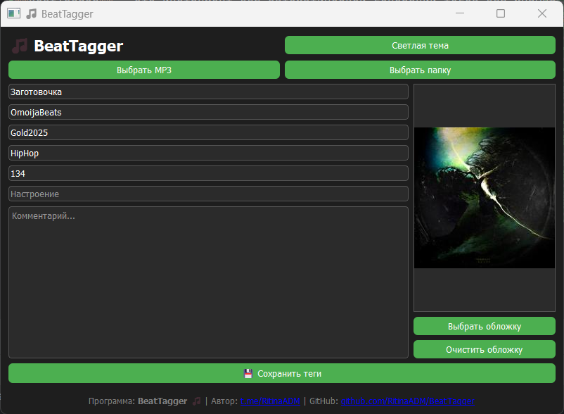

# 🎵 BeatTagger
Автор: [RitinaADM](https://t.me/RitinaADM) | [GitHub](https://github.com/RitinaADM)

**BeatTagger** — это инструмент для автоматической генерации тегов для музыкальных треков с использованием моделей машинного обучения.

## 📸 Скриншоты

&#x20;

## ⚙️ Установка

### 1. Клонируйте репозиторий

```bash
git clone https://github.com/RitinaADM/BeatTagger.git
cd BeatTagger
```

### 2. Создайте и активируйте виртуальное окружение

```bash
python -m venv venv
# На Windows:
venv\Scripts\activate
# На macOS/Linux:
source venv/bin/activate
```

### 3. Установите зависимости

```bash
pip install -r requirements.txt
```

### 4. Запустите приложение

```bash
python main.py
```

## 🧠 Использование

1. Запустите приложение.
2. Выберите аудиофайл для анализа.
3. Отредактируйте теги.
4. Сохраните изменения.


## 🛠️ Разработка

### Структура проекта

```
BeatTagger/
│
├── core/           # Основная логика приложения
├── ui/             # Интерфейс пользователя
├── config/         # Конфигурационные файлы
├── main.py         # Точка входа
└── requirements.txt # Зависимости
```

### Технологии

* **Язык программирования**: Python
* **Библиотеки**:

  * `tkinter` — для графического интерфейса
  * `librosa` — для обработки аудио
  * `scikit-learn` — для машинного обучения

## 🧩 Вклад в проект

1. Форкните репозиторий.
2. Создайте новую ветку (`git checkout -b feature-name`).
3. Внесите изменения и закоммитьте их (`git commit -am 'Добавил новую функцию'`).
4. Отправьте изменения в ваш форк (`git push origin feature-name`).
5. Создайте Pull Request.

## 📄 Лицензия

Этот проект лицензируется под MIT License — подробности см. в файле [LICENSE](LICENSE).
